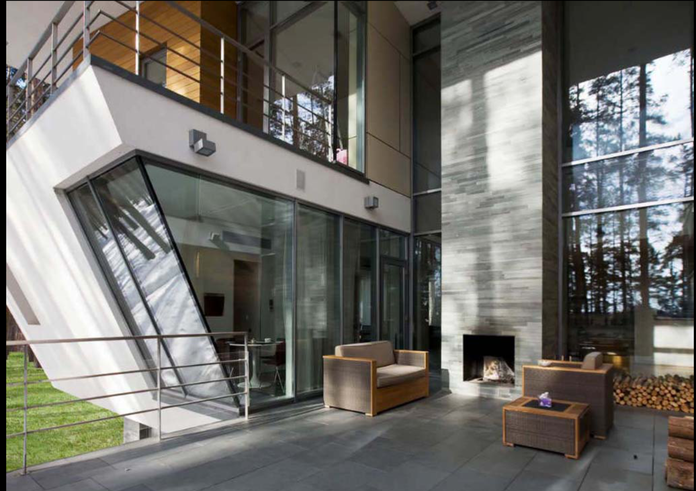
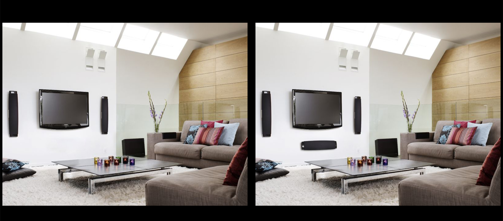

# Change Blindness PsychoPy Experiment

This is a PsychoPy implementation of a [Change Blindness](https://doi.org/10.1016%2FS1364-6613%2897%2901080-2) experiment. Instructions are in Swedish. Stimuli are from the [CB Database](https://doi.org/10.3758/s13428-015-0640-x). This project includes two different versions, where trials proceed as follows:
1. 'Flicker' version ('change_blindness_flicker.psyexp'): Here, the display toggles between two images of the same naturalistic scene, where one of the images includes a target object, while the other image does _not_ include it (i.e. it's been edited out).
2. 'Side by side' version ('change_blindness_sidebyside.psyexp'): Here, two images are shown side by side, where one of the images includes the target object and the other doesn't.

The participant is to, within a set duration, click the target object, whereupon the experiment proceeds to the next trial.

## Running the experiment
_Please note_ that before you can run the experiment as expected, you need to follow the instructions under 'Stimuli' for replacing the placeholder (all-white) image stimuli. Until you've done so, all 'experiment stimuli' are all-white images.
1. Install [Standalone PsychoPy](https://www.psychopy.org/download.html).
2. Download this project, by either using the green 'code' button and selecting 'Download ZIP', or by using `git clone` if you know Git.
3. Open up e.g. 'change_blindness_flicker.psyexp' with PsychoPy.
4. Click the cogwheel ('Edit experiment settings') icon, go to the 'Screen' tab, and insert specifications appropriate for your monitor(s) (if you haven't already, you also need to do setup in Monitor Center - please see the [PsychoPy documentation](https://www.psychopy.org/)).
5. Click the Play ('Run experiment') icon.

You might also wish to change experiment configurations, e.g. trial duration. Some configurations are made in PsychoPy code components, while others are set directly in e.g. Text components.

## Stimuli
The 'img_stimuli' directory holds placeholder image files, which have the correct names but are all-white rather than holding the actual photos. To get the actual stimuli, you need to download the 'Main CB Database' package from the [CB Database](https://doi.org/10.3758/s13428-015-0640-x) (link to database itself is at the end of the abstract):
1. Download the 'Main CB Database' zip file.
2. Unzip the zip file.
3. Copy the contents of the 'Images' subdirectory to the 'img_stimuli' directory in this project, overwriting all files.

The CSV files in the 'specification_csvs' folder describe which particular images are used for both the 'Flicker' and 'Side-by-side' versions of the experiment. The images to be used were picked randomly, apart from making sure that an equal number of 'L' and 'R' images would be used. If you're interested, you can find the scripts used for picking stimuli in the 'pick_stimuli_scripts' directory.

Apart from the images themselves, this experiment also makes use of specifications from the CB Database which describe where target objects are located and their sizes. These specifications describe a 'radius' for each target, meaning that 'target areas' are defined as circles. For elongated objects (e.g. a lamp on a long stand), this leads to parts of the targets 'jutting out of' the target areas. This means that participants' clicks might be registered as being incorrect, even though they actually clicked the target (a part 'jutting out'). To decrease the risk of this happening, this experiment multiplies each target's radius by 2 before checking if the participant's click was within the target area or not. This decreases the risk of false negatives (clicks outside of the 'target area' even though they were on the target object) while increasing the risk of false positives (clicks inside of the 'target area', but not on the target object). It was expected that the risk of false negatives occurring was greater than that of false positives, since it was expected that participants would seldom click on the screen randomly.

## Translating the experiment
In PsychoPy, click the Text Components (e.g. in the routine 'instructions_part_one' there is a component 'text_instructions_part_one'). In the window that pops up, edit the 'Text' field. It's recommended that you copy and paste the Swedish text snippets into e.g. Google Translate as a start.

Once you've finished translating the experiment, save it ('Save current experiment file' in main window toolbar) and try running it again.

## Output data
The most relevant output data files are the 'CSV'/'.csv' files, saved to the 'data' directory. The most important columns in these files are as follows:

* target_present: File name of trial image where target object is present.
* target_present: File name of trial image where target object is absent.
* target_radius_px: Radius of target object.
    - Note that this (and X/Y coordinates below) is in pixels in the original image file. That is, the radius does _not_ relate to pixels on the display screen itself.
* target_xcoord_px: X coordinate of target object.
* target_ycoord_px: Y coordinate of target object.
* mouse_trial.x: X coordinate of participant's click.
    - Note that this and other 'mouse_trial' data are enclosed in square brackets, e.g. `[-848.0]`. This is an unfortunate artifact caused by how PsychoPy stores mouse data by default. It can be corrected if you're proficient with PsychoPy. Otherwise, you will need to remove these brackets at the data processing stage, easily done with say [R](https://www.r-project.org/) or Python.
    - If the participant didn't click before the trial duration time ran out, the cells/fields here will hold empty brackets `[]`.
* mouse_trial.y: Y coordinate of participant's click.
* mouse_trial.correct: Specifies whether participant clicked within target circle (0) or not (1).
* mouse_trial.time: Specifies time in seconds _counting from trial onset_ at which participant clicked.
* trial_start_time: Specifies time in seconds _counting from beginning of experiment_ at which trial started.

## (not) Running the experiment online
This experiment was only developed for local use, i.e. not with online use in mind. It uses some custom Python code, which makes it somewhat harder to convert to JavaScript for running the experiment online. If you do create an online version however, you're very welcome to send an e-mail to datalowe-at-posteo.de, and then I can add a link to your work here.

## Attribution
All the stimuli used in this experiment are from the Change Blindness database, which was created by Preeti Sareen, Krista A. Ehinger and Jeremy M. Wolfe. Please cite the following article if you use this experiment and/or any of the stimuli:

> Sareen, P., Ehinger, K.A. & Wolfe, J.M. CB Database: A change blindness database for objects in natural indoor scenes. Behav Res 48, 1343–1348 (2016). https://doi.org/10.3758/s13428-015-0640-x

(note that the above information also applies to the images in the 'example_images' directory)

This PsychoPy implementation was developed by Lowe Wilsson for a synesthesia research group at Karolinska Institutet, led by Janina Neufeld.

The PsychoPy implementation itself (but not the stimuli) is licensed with the [MIT license](https://mit-license.org/), meaning you are free to use and modify everything, except Change Blindness Database stimuli, in this project.

Though it's not required, you are very welcome to link to [this project's GitHub repository](https://github.com/anonzebra/change-blindness-psychopy) so that others can find it.
